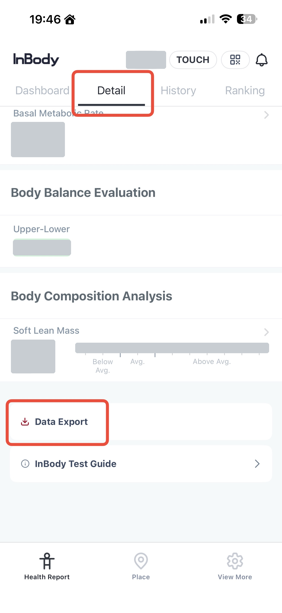
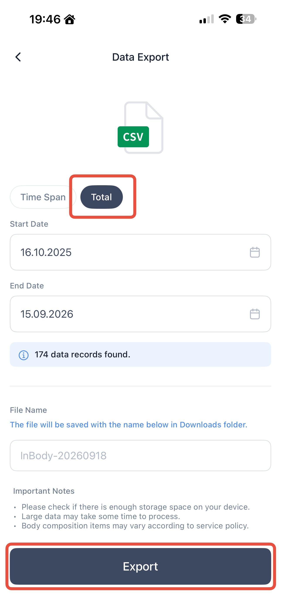

# syncwithgarmin

Uploads InBody CSV exports (LookinBody "date,Measurement device.,Weight(lb),..." format)
to Garmin Connect as body-composition weigh-ins, via
[python-garminconnect](https://github.com/cyberjunky/python-garminconnect).

## Exporting your InBody data

In the **InBody** app (the LookinBody-backed one):

1. Open the **Detail** tab from the *Health Report* screen, scroll to the bottom and tap
   **Data Export**.
2. Switch the range selector to **Total** to get your whole history (or use **Time Span**
   and pick start/end dates). It shows how many records matched.
3. Tap **Export**. The CSV lands in your device's **Downloads** folder, named
   `InBody-YYYYMMDD.csv`.

Get that file onto the machine running this script (AirDrop, Files, iCloud Drive) and pass
its path as the `csv` argument.

| 1. Detail → Data Export | 2. Total → Export |
|---|---|
|  |  |

Personal values are blanked out in the first screenshot.

## Setup

Requires Python 3.9+.

```bash
git clone https://github.com/mahyaret/syncwithgarmin.git
cd syncwithgarmin
python3 -m venv .venv && source .venv/bin/activate
pip install -r requirements.txt
```

## Usage

Dry run first — nothing is sent to Garmin without `--upload`:

```bash
python sync_inbody.py ~/Downloads/InBody-20260901.csv
python sync_inbody.py ~/Downloads/InBody-20260901.csv --since 2026-08-01
python sync_inbody.py ~/Downloads/InBody-20260901.csv --since 2026-08-01 --upload
```

Options: `--since YYYY-MM-DD`, `--limit N` (most recent N), `--per-day last|first|all`,
`--delay SECONDS` (default 1.5s between uploads),
`--force` (bypass dedupe), `--reset-state`, `--relogin`, `--replace` (see below).

### Fixing entries already uploaded

`--replace` deletes every existing Garmin weigh-in on each date it is about to write,
then re-uploads from the CSV. It prompts for confirmation and **also deletes weigh-ins
from other sources** (scale, manual entry) on those dates. Pair it with `--reset-state`
so the local state file doesn't skip the rows you want rewritten:

```bash
python sync_inbody.py ~/Downloads/InBody-20260901.csv --replace --reset-state --upload
```

## Logging in

Credentials come from `GARMIN_EMAIL` / `GARMIN_PASSWORD` if set, otherwise it prompts.
MFA is prompted interactively. OAuth tokens are cached in `~/.garminconnect`
(override with `GARMINTOKENS`) so later runs don't need the password.

Login runs in two passes:

1. **Cached tokens, with no credentials supplied.** This is deliberate — given a
   password, `garminconnect` treats an API-rejected cache as poisoned and silently
   falls back to a full SSO login, and that fallback is what trips Garmin's rate
   limiter. With no password it just reports the failure and leaves the cache alone.
2. **Email/password**, only if the cache is missing or unusable. The tokenstore is
   copied aside first and restored if this pass fails, so a bad login can't cost you
   working tokens. `--relogin` skips pass 1 and goes straight here.

### `HTTP 429 — rate limited`

Garmin rate-limits login attempts per IP. `garminconnect` tries several login routes
(two mobile, three web) and warns per route, so lines like

```
mobile+cffi returned 429: ... IP rate limited by Garmin
mobile+requests returned 429: ... IP rate limited by Garmin
```

are **not fatal on their own** — a later route often succeeds. In particular, if you
then get an `MFA code` prompt, Garmin has accepted your password and sent a code;
enter it. Only when *every* route is limited does the login fail outright, and then
this script exits with status 2 and an explanation instead of a traceback.

If you do hit that: wait it out (usually under an hour, occasionally longer) and don't
retry in a loop, which extends the block. Your cached tokens are left intact, so once
it clears a normal run may not touch the login endpoint at all.

## Field mapping

| InBody column | Garmin field | Note |
|---|---|---|
| `Weight(lb)` | `weight` | converted to kg |
| `Percent Body Fat(%)` | `percent_fat` | |
| `Skeletal Muscle Mass(lb)` | `muscle_mass` | kg; Garmin has one muscle field and SMM is the number on the InBody sheet |
| `BMI(kg/m²)` | `bmi` | |
| `Basal Metabolic Rate(kcal)` | `basal_met` | |
| `Visceral Fat Level(Level)` | `visceral_fat_rating` | InBody 1–20 scale vs Garmin 1–59 — number is passed through as-is |
| `Total Body Water(L)` | `percent_hydration` | `TBW / weight_kg * 100` |
| `date` | `timestamp` | `YYYYMMDDHHMMSS`, treated as local time |

Columns InBody left as `-` are omitted. `bone_mass` is never sent: Bone Mineral Content
is empty in these exports, and BMC is not the same quantity as Garmin's bone mass anyway.
Every row has Skeletal Muscle Mass, but only model 570/380 rows measure Total Body Water,
so `percent_hydration` is sent for those rows only.

Garmin's FIT weight-scale record has exactly one muscle field and no lean-mass field, so
SMM goes there. Note that a Garmin Index scale would populate that field with total muscle
mass — a much larger number — so mixing this script with an Index scale would produce a
discontinuous series.

## Duplicate protection

Two layers, both bypassable with `--force`:

1. `.synced.json` records every uploaded timestamp locally.
2. Before uploading, existing Garmin entries for the date range are fetched and a row is
   skipped if that calendar date already has a weight within 0.15 kg. This is a heuristic —
   two genuinely distinct same-day measurements at nearly identical weight will collapse to one.

To undo an upload, use `client.delete_weigh_in(weight_pk, cdate)` or delete the entry in
the Garmin Connect app.

## Disclaimer

Unofficial and unaffiliated with Garmin or InBody. It talks to Garmin Connect through
python-garminconnect, which uses Garmin's private web API — that API can change or
rate-limit without notice. It writes to (and with `--replace`, deletes from) your real
Garmin account, so always dry-run first. No warranty; see [LICENSE](LICENSE).

Your CSV exports and `.synced.json` are health data and are gitignored — keep them that way.

## License

[MIT](LICENSE)
